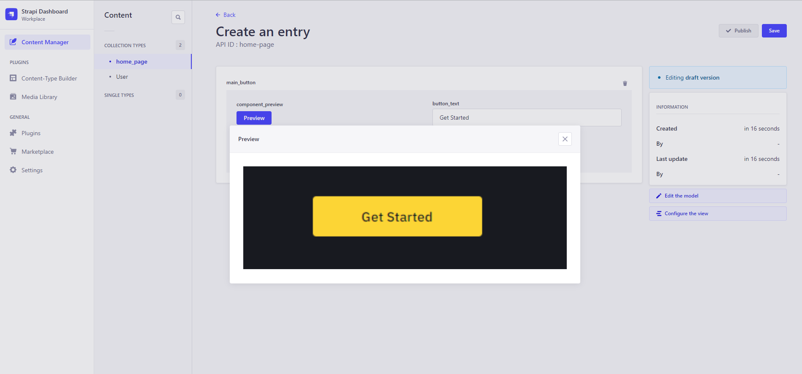

# Component Preview - Strapi Plugin

Component Preview plugin is used to view the actual component through a custom field in strapi. This plugin helps to give a live preview the component we are using. That helps to easily understand the component using.

## Getting Started

The plugin can be used in strapi version above 4.4 (versions that support custom fields).

### To Install

1. Go into your strapi project.
2. Run the npm command `npm i strapi-plugin-section-preview`
3. The plugin will be added to your strapi project.

Inorder to achieve the url of the file uploading it must be specified in the .env file as **STRAPI_ADMIN_BACKEND_URL**. This url need to be the base url of the admin.

### Adding & Accessing URL

1. No need to configure anything

## How To Use

1.  Create a new field form a content type.
2.  Select custom fields.
3.  **Section Preview** field will appear there.
4.  Select this field and name it accordingly ("section_preview" is used commonly for more understanding) and save.
5.  Add the url.
6.  Select the content type from the content manager.
7.  Click on the preview button from the content type builder and then the section preview will pop up.
